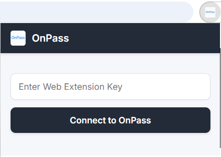

# OnPass Extension

## Overview

OnPass Extension is a Manifest V3 browser extension that connects the browser to the OnPass desktop application. It allows a user to enter an OnPass Web Extension Key, retrieve credentials from the local desktop service, and autofill login forms on supported websites.

The extension is designed for both traditional and modern websites, including those that use dynamic rendering patterns such as delayed form mounting, DOM replacement, nested wrappers, Shadow DOM, and iframe-based login pages. To handle these cases, the autofill logic uses field classification, login-context detection, retry scheduling, and framework-compatible value filling.

## Features

- Connects to the OnPass desktop application using a token-based local authentication flow
- Stores the access token in `chrome.storage.local`
- Retrieves passwords from the desktop app over `localhost`
- Shows an inline autofill popup when username or password fields are detected
- Ranks credentials by domain relevance before showing suggestions
- Supports dynamic login pages through focus retries, mutation observation, and field stabilization
- Supports iframes via `all_frames: true` and `match_about_blank: true`
- Provides a popup interface for viewing saved passwords and copying usernames or passwords

## Architecture

The project is split into small modules to separate browser-extension responsibilities clearly:

- `background/`
  Service worker logic for token validation, password retrieval, in-memory caching, and domain-based filtering for content scripts.
- `content/`
  Autofill engine injected into pages. This layer detects login fields, decides when to show the inline popup, and performs framework-safe autofill.
- `popup/`
  Extension popup UI for connecting to OnPass, loading saved passwords, searching them, and copying usernames or passwords.
- `shared/`
  Reusable constants, domain helpers, and API client utilities shared across popup and background modules.
- `assets/`
  Extension icons.

## Design Rationale

The extension intentionally uses two different access patterns:

- The popup calls the local desktop API directly through the shared API client because the user is explicitly browsing or copying credentials.
- The content script goes through the background service worker because autofill benefits from short-lived caching, token validation, and domain-aware filtering before rendering suggestions.

This split keeps the popup simple while making autofill more efficient and more reliable.

## Autofill Flow

The autofill pipeline works as follows:

1. The user focuses an editable field on a webpage.
2. The content script resolves the real target field, even if the event came from a wrapper, composed path, or shadow-root host.
3. The detection engine classifies the field as `username`, `password`, `otp`, `search`, or `other`.
4. A login context is built from the surrounding form or auth-like container.
5. The popup trigger is retried across animation frames and short delays to handle React/Vue style rerenders.
6. The content script asks the background worker for saved passwords.
7. The background worker validates the access token, fetches passwords from the local desktop service if needed, and filters them by related domain.
8. The content script ranks results by domain quality and shows the inline popup.
9. When the user selects a credential, the extension fills the best username and password targets using native value setters and dispatches input-related events so modern frameworks detect the changes.

## Popup Flow

The browser-action popup provides a direct access flow:

1. The user opens the extension popup.
2. The user enters the OnPass Web Extension Key.
3. The popup validates the token against the local desktop service.
4. If validation succeeds, the token is stored locally and the password list is loaded.
5. The user can search saved entries and copy usernames or passwords to the clipboard.

## Security Notes

- The extension does not hardcode any user passwords.
- Passwords are retrieved from the local desktop application over `localhost`, not from a remote cloud API.
- The access token is stored in `chrome.storage.local`.
- The background worker validates the token before serving autofill password data.
- Password caching in the background is short-lived and held in memory only.
- Domain filtering reduces accidental credential suggestions on unrelated sites.

## Project Structure

```text
OnPass-Extension/
|-- manifest.json
|-- README.md
|-- assets/
|   `-- icons/
|-- background/
|   |-- index.js
|   |-- cache.js
|   |-- domain-match.js
|   |-- listeners.js
|   |-- passwords-api.js
|   `-- token.js
|-- content/
|   |-- index.js
|   |-- autofill-core.js
|   |-- autofill-engine.js
|   |-- autofill-detection.js
|   `-- autofill-fill.js
|-- popup/
|   |-- popup.html
|   |-- popup.css
|   |-- popup.js
|   |-- popup-api.js
|   |-- popup-storage.js
|   `-- popup-view.js
`-- shared/
    |-- api-client.js
    |-- constants.js
    `-- domain-utils.js
```

## Key Technical Decisions

- `Manifest V3` is used with a background service worker.
- Shared modules reduce duplication between popup and background logic.
- Domain comparison supports related hosts such as `example.com` and `auth.example.com`.
- The content script uses a stateful detection engine rather than a single focus handler, because simple focus-only detection is unreliable on modern sites.
- Native input setters and synthetic events are used so controlled inputs on React/Vue-style pages accept autofilled values correctly.

## Prerequisites

- The OnPass desktop application must be installed and running
- The desktop app must expose the local extension API on a supported port
- You need a valid OnPass Web Extension Key from the desktop application
- You need a Chromium-based browser that supports Manifest V3 extensions

## Installation

1. Start the OnPass desktop application.
2. Open the browser extensions page and enable Developer Mode.
3. Choose `Load unpacked`.
4. Select the extension folder that contains `manifest.json`.
5. Pin the extension to the browser toolbar if desired.

## Setup

1. Open the OnPass desktop application and copy the OnPass Web Extension Key.
2. Click the extension icon in the browser toolbar.
3. Paste the key into the popup input field.
4. Select `Connect to OnPass`.
5. Wait for the popup to validate the key and load saved passwords.

## Popup Screenshot

<p align="center">
  
</p>

## Usage

1. Navigate to a login page.
2. Click into a username, email, or password field.
3. Wait for the OnPass inline popup to appear.
4. Select the saved credential you want to use.
5. Let the extension autofill the detected login fields.

You can also open the browser-action popup at any time to search saved entries and copy usernames or passwords manually.

## Supported Browsers

- Google Chrome
- Microsoft Edge
- Brave
- Other Chromium-based browsers with Manifest V3 support

## Local API Assumptions

The extension expects the OnPass desktop application to expose local endpoints such as:

- `GET /validate`
- `GET /passwords`

The shared API client currently tries the configured local ports defined in `shared/constants.js`.

## Current Limitations

- The desktop application must be running for token validation and password retrieval.
- The extension depends on local API availability on the expected ports.
- Highly custom websites may still require additional heuristics in edge cases.
- Domain matching is practical and lightweight, but not a full public-suffix implementation.
- The project currently does not include an automated test suite.

## Future Improvements

- Add automated tests for domain matching and field classification
- Add a packaging and release script for the extension
- Strengthen domain matching with a richer public-suffix strategy
- Add debug toggles and diagnostics documentation for troubleshooting difficult websites
- Expand technical documentation for maintainers and future contributors

## Summary

OnPass Extension is a modular browser extension that securely connects to the OnPass desktop app and provides reliable autofill behavior on modern websites. Its design focuses on local authentication, domain-aware credential selection, and resilient field detection for real-world login pages.
